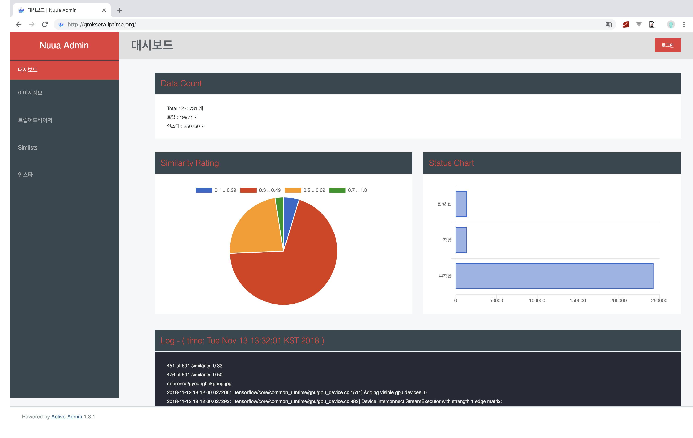
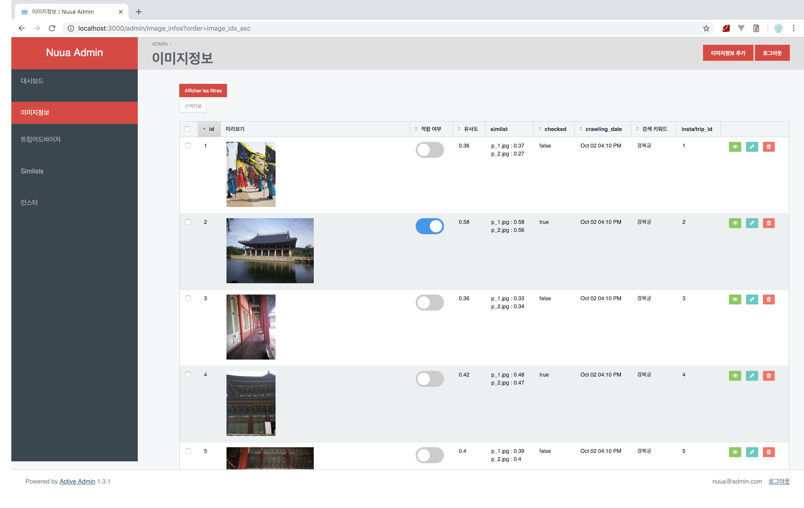

# 이미지 전처리 관리자 페이지

## 목적

* #### 데이터 베이스 관리를 용이하게 하기 위함

* #### 크롤링한 이미지 데이터들 중 학습에 적합한 train set을 걸러내기 위해 수기 라벨링의 필요성

### 페이지 대시보드 

### 이미지 전처리를 위한 주요 기능

* 이미지를 보고 적합시 토글바를 이용해서 적합한 이미지를 골라냄 
  * 유저가 직접 손으로 수기 라벨링 한 데이터는 checked가 true로 바뀜

## 사용 프레임워크 , 언어 

* ruby 2.4.2
* rails 5.2.1

## 사용한 gemfile

gem 'activeadmin'
gem 'devise'
gem 'cancan' # or cancancan
gem 'draper'
gem 'pundit'
gem 'active_admin_flat_skin'
gem "font-awesome-rails"
gem 'activeadmin_addons'
gem 'enumerize'
gem 'active_median'
gem "chartkick"
gem "highcharts"
gem "figaro"

 <a href="http://gmkseta.iptime.org:3000">페이지 링크 : gmkseta.iptime.org</a>

